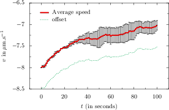

# Python-Tools
This repository contains generic but useful python utilities

## seplot

 A command line plot maker.  
 Examples :  
 seplot position.txt  
 seplot position.txt color=red position2.txt  
 seplot averages.txt y='A[:,1]-A[:,2]' dy='A[:,3]/sqrt(A[:,4])' ylabel='$z$ in nm' color=cmyk.Green

## sio_tools

  Simple I/O utilities used by other projects
  Reading/writing array from/to file
  Running bash jobs from python and returning output
  File text cleanup and parsing
  And quite a bit more…

## ply :
Utilities to work with ply files

## shooting
Utilities implementing the shooting method

# Serge Dmitrieff -- http://biophysics.fr
